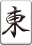

# リアル麻雀入門ドキュメント

## 対象
* 麻雀初心者の方
* ゲームで遊んだことはあるがリアル牌を使って遊んだことがない方

## 目次
1. ゲームの流れを体感
2. ゲームの基本の動作
3. 牌の種類
4. 上がり方
5. 役
6. 練習ルールでお試し対局

---
## ゲームの流れを確認
* 下記サイトで一通りプレイできるのでゲームの流れを体感します。
    * https://www.gamedesign.jp/flash/mahjong/mahjong.html

## ゲームの基本の動作
* 最初に13枚もらう
* 親プレーヤーから半時計回りに順番が回る
* 自分の番になったら一枚取ってきて、いらない牌を一枚捨てる
* 誰かが上がるか山がなくなるまで繰り返す

## 牌の種類
トランプのマークみたいなものです。
5種類あります。

萬子（まんず）、筒子（ぴんず）、索子（そうず）は1-9の数字を持っています。

* 萬子（まんず）  
    
    
    
    
    
    
    
    
    
    1萬~9萬
* 筒子（ぴんず）  
    
    
    
    
    
    
    
    
    
    1筒~9筒
* 索子（そうず）  
    
    
    
    
    
    
    
    
    
    1索~9索
* 風牌（ふうぱい）  
    
    
    
    
    東南西北
* 三元牌（さんげんぱい）  
    
    
    
    白発中

## 上がり方
* 14枚を使って、3枚セットを4つと2枚セットを1つを揃えると上がりになります。

    * 例1  
    
    
    3枚
    
    
    3枚
    
    
    3枚
    
    
    3枚
    
    2枚

    * 例2  
    
    
    3枚
    
    
    3枚
    
    
    3枚
    
    
    3枚
    
    2枚

* 3枚セットには2つ種類があります。
    * 3枚同じものセット  
        
        
        
        
        
        
        

        
        
        

    * 連続した数字セット  
        
        
        

        
        
        

        
        
        
        
        
        ※1と9は繋がらないため、912はセットになりません。  
        NG 
        
        
        
        ※数字を持つ牌だけ利用可能であり、字牌はセットになりません。  
        NG
        
        
        NG
        
        

    

* 上がるときの発声
    * ツモ  
        自分が取ってきた牌で上がりの状態になったとき「ツモ」と発声します
    * ロン  
        相手が捨てた牌で上がりの状態になったとき「ロン」と発声します

## 役
* ポーカーのワンペア、ストレート、フラッシュみたいなものです。
* 上がるには役が最低一つ必要です。

* 覚えやすい役
    * リーチ  
    あと1枚揃えば上がりの形が揃う場合にリーチと宣言すると成立します。  
    リーチを宣言した後はツモってきた牌と手牌を入れ替えることができません。
        * 例1  
        
        
        
        
        
        
        
        
        
        
        
        
        
          
        あと1枚が来れば上がりなので
        を切る際に「リーチ」と宣言すると役がつきます。

    * タンヤオ  
    1・9・字牌を一つも使わず、数牌の2～8のみを使って手牌を完成させた場合に成立します。面子は連続した数字、3枚同じものどれでもOK。
        * 例  
        
        
        
        
        
        
        
        
        
        
        
        
        
          

    * 三元牌  
    白・發・中のいずれかで、同じものを3枚集めると成立します。
        * 例  
        
        
        
        
        
        
        
        
        
        
        
        
        
        
    * 風牌  
    自分の座席や現在の場風に応じて、東・南・西・北のいずれかで、同じものを3枚集めると成立します。
        * 例  
        
        
        
        
        
        
        
        
        
        
        
        
        
        

    * その他の役知りたい方はこちらへ

## 練習ルールでお試し対局
手牌オープン＆4人全員が上がるまで終わらないルール  
（通常は誰かが上がったらそのゲームは終わりだが、皆に上がりを経験してもらいたいため。）

## 終わり
---
## 以下は時間があったら＆興味がある人がいれば。

## 鳴き
* ポン  
    * 他のプレーヤーが捨てた牌で同じもの3枚セットが成立するとき、「ポン」と発生すると捨てられた牌をもらうことができます。
* チー  
    * 左隣のプレーヤーが捨てた牌で連続した3枚セットが成立するとき、「チー」と発声すると捨てられた牌をもらうことができます。  
    ※向かい側と右側のプレーヤーからチーはできないので注意
* カン  
    * 同じ牌を4枚揃えたときに「カン」と発生するとできます。
    他のプレーヤーが捨てた牌をもらってもよいですし、自分で4枚集めてカンしてもOKです。
    * ドラが増えます。  
* 資料  
    * 副露とは！ポン、チー、カンで鳴きを制し速攻役付テンパイ！  
    https://majandofu.com/mahjong-furo

## ドラ
* ボーナス役です。
* 上がったときにドラを持っていると点数が高くなります。
* あくまでもボーナスのため、ドラだけで上がることはできません。他に役を作る必要があります。
* 資料  
    * ドラ
    http://www2.odn.ne.jp/~cbm15900/html/n13.html

## 関連情報
* 他いろんな入門情報  
    * 麻雀ルール入門！初心者が覚えるべき基本知識  
    https://majandofu.com/mahjong-introduction
* もっとうまくなりたい人向け
    * 初心者のための麻雀戦術・勝つための麻雀講座 
    http://www2.odn.ne.jp/~cbm15900/html/k0.html

