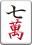

# リアル麻雀入門ドキュメント

## 対象
* 麻雀初心者の方
* ゲームで遊んだことはあるがリアル牌を使って遊んだことがない方

## 目次
1. 基本の動作
2. 上がり
3. 役
4. 実践

## 麻雀とは
* 基本4人で行うゲームです。  
牌と呼ばれるコマを使用します。  
牌を14枚集めて完成を目指すゲームです。  
一番最初に完成させた人が勝者となり点数がもらえます。  
最終的に一番点数を持っていた人がゲームの勝者となります。

## 牌の種類
34種類、136枚の牌を使います。
* 数牌
    * 萬子（まんず）  
        
        
        
        
        
        
        
        
        
        1萬~9萬
    * 筒子（ぴんず）  
        
        
        
        
        
        
        
        
        
        1筒~9筒
    * 索子（そうず）  
        
        
        
        
        
        
        
        
        
        1索~9索
* 字牌
    * 風牌（ふうぱい）  
        
        
        
        
        東南西北
    * 三元牌（さんげんぱい）  
        
        
        
        白発中
        

## ゲームの基本の動作
1. 牌山を並べる
    * 下記のように各々が自分の前に牌を並べます。

2. 配牌を取る
    * 13枚になるように牌を取っていきます。
    半時計回りに4枚×3回+1枚×1回ずつ取ります。

3. 摸打（もーた）
    * 一枚取って不要な牌を一枚捨てます。
    半時計回りに順番に摸打を行い、誰かが上がるか山がなくなるまで続けます。

## 上がり方
面子（めんつ）という3枚セットを4つと、雀頭（じゃんとう）という同じ牌2枚セットを1つ揃えます。
* 3枚セットの種類
    * 連続した数字を並べる
        123,345,789など。
        * 
        
        
        * 
        
        
        * 
        
        
        * ※1と9は繋がらないため、912は面子になりません。  
        NG 
        
        
        * ※数字を持つ牌だけ利用可能であり、字牌は面子になりません。  
        NG
        
        
        NG
        
        

    * 3枚同じものを揃える
        111,555,東東東など。  
        
        
        
        
        
        
        

        
        
        
        

* 上がるときの発声
    * ツモ  
        自分が取ってきた牌で上がりの状態になったとき
    * ロン  
        相手が捨てた牌で上がりの状態になったとき

## 役
* 1翻縛り  
    上がるには14枚で特定の組み合わせを作り、最低一つの役を付ける必要があります。

* おすすめの役
    * リーチ（1翻、鳴きNG）  
    あと1枚揃えばアガりの形が揃う状態になっている場合、リーチと宣言して1,000点を場に出すことで成立。どんな手牌でも1役つく。
    * タンヤオ（1翻、鳴きOK）  
    1・9・字牌を一つも使わず、数牌の2～8のみを使って手牌を完成させた場合に成立する。面子は連続した数字、3枚同じものどれでもOK。
    * 役牌（1翻、鳴きOK）  
    三元牌の白・發・中、風牌となる 自風牌 や 場風牌 の 東・南・西・北 で 3枚セット作ると成立する役。

* 役一覧表  
    あとで書く

## 練習ゲーム
手牌オープン＆4人全員が上がるか山がなくなるまでお試しゲーム

## 時間があれば鳴きの説明？
* ポン
* チー
* カン

## 時間があればドラの説明？

## 関連情報
* 麻雀ルール入門！初心者が覚えるべき基本知識  
    https://majandofu.com/mahjong-introduction
* 副露とは！ポン、チー、カンで鳴きを制し速攻役付テンパイ！
    https://majandofu.com/mahjong-furo
* 麻雀上達編　～筋読みや牌効率を学ぼう～
    https://majandofu.com/level-up

